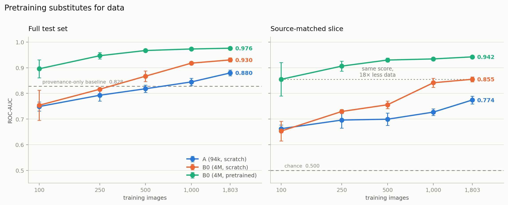

# Wildfire Detection: a custom CNN vs transfer learning

A comparison of a hand-designed 94k-parameter CNN against EfficientNet-B0, in PyTorch. Why does transfer learning win over a custom CNN?

For the full blog on what I planned to do, the decisions I made, the reasonings behind them, my mistakes, more figures and reports, and a deeper dive into this project -> click on the link below to visit my website to read about it.

**[rayyanhuda.com](https://rayyanhuda.com/)**

---

## The problem

With the global news of the spread of Canadian wildfire in my region, I took it upon myself to develop machine learning models to detect wildfire from images.

I picked a public wildfire dataset and found its two sources:
Flickr and Unsplash. Unfortunately, the source almost determines the label (made my job expontentially harder):

| source | fire | nofire |
|---|---|---|
| Flickr | 989 | 198 |
| Unsplash | 56 | 1,456 |

**A classifier that reads only the filename and never opens an image scores 92.4% on the official test split.** The majority-class baseline is 61.2%. So any result on this benchmark has to clear 92.4% before it means anything, and a model can get there by learning stock-photo style rather than fire.

## What I planned

Build a CNN from scratch, fine-tune EfficientNet-B0, compare them on accuracy, data efficiency, overfitting behaviour and inference speed.

## What I did instead

After discovering the shortcut in the dataset, I restructured the experiment around 3 changes to isolate real performance from dataset bias:

1. **Rebuilt the split (group-aware & stratified)**  
   *Prevented data leakage and style memorization.* If a single photographer uploaded 10 pictuers from the same photo session, and 8 went into the training set and 2 went into the test set, the model could easily "cheat" by recognizing that specific photographer's style or location.
   My fix for this was to make **all images from the same photographer** or **upload session** stayed together in the same set (either all in training, or all in testing).

2. **Added a source-matched evaluation slice**  
   *Created a shortcut-free benchmark.* In the main test set, the shortcut still existed (Flickr mostly = Fire, Unsplash mostly = No Fire). If a model got a high school, I couldn't tell if it was smart or just good at guessing the website source.
   So I created a test subset of $247$ images where the numbers were balanced (equal mix of Flickr and Unsplash images for both fire and no-fire). On this subset, guessing the website source is an exact 50% score (pure luck).
   This was my true stress-test. If a model scored high on this slice, it proves it is actually looking at fire, and not a loophole.

3. **Added a third model arm (`B0-scratch`)**  
   *Separate architecture vs. pretraining.* Comparing just the custom scratch CNN vs EfficientNet-B0 (pretrained on ImageNet), if EfficientNet won, I wouldn't know if it was because EfficientNet has a much better architectural design, or because it already saw millions of images during pretraining.

   So I added a third control group: EfficientNet-B0 trained from scratch (`weights=None`). This separates the variables so:
    - Custom CNN vs B0-scratch: Compares architecture alone
    - B0-scratch vs B0-pretrained: Compares pretraining alone

    Result: At full dataset size, the performance gap split almost 50/50 between better architecture and pretraining

Everything else is held fixed across arms: same split, 160×160 inputs, augmentation, optimiser, schedule, epoch, early-stopping rule, hardware. Three seeds per configuration.

## Results

ROC-AUC, mean ± sample std over 3 seeds, single Tesla T4.
The full-test AUC is the performance on the standard test split (a model can score high here just by identifying stock-photo camera quality, saturation, or watermarks.)

The source-matched AUC is the performance on the curated subset of 247 images where Flickr and Unsplash images are evenly balanced across fire and non-fire categories.

| model | params | MMACs | full-test AUC | **source-matched AUC** |
|---|---|---|---|---|
| majority class | — | — | 0.500 | 0.500 |
| **source only** (never sees the image) | — | — | **0.828** | **0.500** |
| A — custom CNN, from scratch | 93,601 | 263.8 | 0.880 ± 0.011 | 0.774 ± 0.015 |
| B0-scratch — EfficientNet-B0, random init | 4,008,829 | 211.5 | 0.931 ± 0.008 | 0.855 ± 0.010 |
| B0-pretrained — EfficientNet-B0, fine-tuned | 4,008,829 | 211.5 | 0.976 ± 0.001 | **0.942 ± 0.003** |

## What happened

**Pretraining is worth ~18× the data.** EfficientNet trained on just 100 images (with pretraining) scored the exact same score ($0.855$) as the same model trained on all 1,803 images starting from scratch. Pre-learned visual knowledge (understanding edges, textures, and shapes from ImageNet) acted like a multiplier, making a tiny dataset perform like a dataset nearly 20 times its size.

**Half the "transfer learning advantage" is architecture, not pretraining**. When comparing the custom model to the pretrained EfficientNet, there was a $0.168$ total jump in accuracy:

- $48\%$ of that jump came from EfficientNet having a much smarter design (depthwise convolutions, better layer structure).
- $52\%$ came from ImageNet pretraining.

What's unique though, is that at $100$ images, the 4-million-parameter EfficientNet trained from scratch performed slightly worse than the tiny $94\text{k}$-parameter model. *A complex architectural design is useless without enough data to learn its parameters.*

**Pretrained features resist the shortcut.** "Shortcut reliance" measures how much higher a model scores on the flawed test set versus the clean test slice.The Custom CNN had a massive gap ($0.106$), meaning it relied heavily on website style.The Pretrained EfficientNet had a tiny gap ($0.034$). Because it already knew what natural objects looked like, so it looked for actual fire features rather than photo-style hints.

**Hard negatives stay hard.** Images with heavy fog, lens glare, or bright sunsets look visually similar to smoke and fire. Even the best pretrained model mistook $33\%$ of these look-alikes for fire (compared to only a $4\%$ error rate on standard forest images). Adding more training images didn't fix this because the visual features overlap at $160\times160$ resolution.

At a low resolution like $160\times160$ pixels, fine visual details are completely blurred out or lost:

- Textural Loss: Smoke has a turbulent, billowy texture, whereas fog or lens glare is usually smooth diffused. At $160\times160$, those high-frequency texture details disappear, which makes both smoke and fog into smooth greyish-white blobs.
- Structural Loss: Fire has sharp, flickering, irregular edges. A bright sunset horizon at low resolution becomes a low-detail gradient of bright orange pixels, the exact same cluster of orange pixels that represents a distant flame.

When these crucial diagnostic details are stripped away by low spatial resolution, the two concepts become mathematically identical in pixel space. The model isn't being "dumb", it's just impossible for the model to differentiate the difference at that scale.

**Removing the shortcut with augmentation failed.** I tried converting images to grayscale or changing colors (color jitter) to stop models from recognizing Flickr's saturated colors. But doing that made the models worse overall because fire is defined by its orange/red color. If the shortcut and the actual target share the same channel (color/saturation), destroying the shortcut also destroys the model's ability to see the fire.

**Parameter count is not compute.** People assume a $94\text{k}$-parameter model is "lighter" than a $4\text{M}$-parameter model. But:

- The $94\text{k}$ model actually does more mathematical operations ($263.8$ million vs. $211.5$ million per image) because its internal feature maps are larger.
- The $4\text{M}$ model is faster on CPUs during batch processing, even though the $94\text{k}$ model takes up $43\times$ less storage space and runs faster for single images on GPUs.

## Limitations

- **Not comparable.** The dataset split was rebuilt to prevent the models from cheating. You can't directly compare these accuracy numbers on this hard split to a model evaluated on the original, flawed split; i twould be like comparing scorse from two very different tests.
- The clean test slice only has 247 images. On a small test group that size, slight changes in scores happen purely due to random chance (like how the random seed shuffled the batch or initialized weights). Only score gaps larger than $0.02$ represent real, meaningful performance differences.
- **Training data is stock photography.** The model was trained on pretty photos, not real industrial surveillance footage. They rarely feature tiny wisps of early stage smoke, which is what a real fire-detection system needs to catch before a wildfire spreads. 
- At $160\times160$ resolution, some pictures are so low-detail that even a human (me) looking at them can't tell if it's a sunset or a fire. If a human can't classify the image confidently, penalizing the model for guessing wrong isn't entirely fair, some photos are just ambiguous and misleading.

## Sources

- Dataset: [The Wildfire Dataset](https://www.kaggle.com/datasets/elmadafri/the-wildfire-dataset)
- El-Madafri I, Peña M, Olmedo-Torre N. The Wildfire Dataset: Enhancing Deep Learning-Based Forest Fire Detection with a Diverse Evolving Open-Source Dataset Focused on Data Representativeness and a Novel Multi-Task Learning Approach. Forests. 2023; 14(9):1697. [Article Link](https://doi.org/10.3390/f14091697)